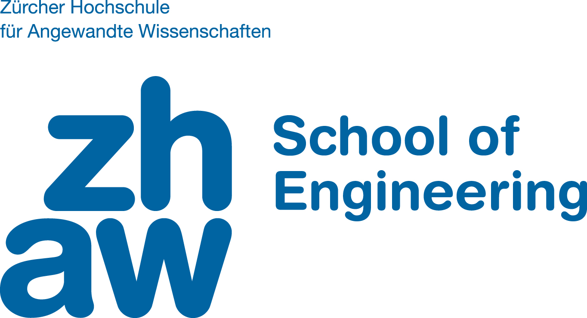

:doctype: book
:Author: Orlando Tomás
:Email: orlando.tomas@zhaw.ch
:Date: 2019-04-04
:Revision: 1.0
:pdf-style: custom-theme.yml
:pdf-stylesdir: themes
:icons: font
:title-logo-image: 
:toc: left
:toc-title: Inhaltsverzeichnis
:toclevels: 2
:stem:

CAS BIDA 2018 Semesterarbeit: Lotterie als Smart Contract
=========================================================
{author} {email}
{revision}, {date}